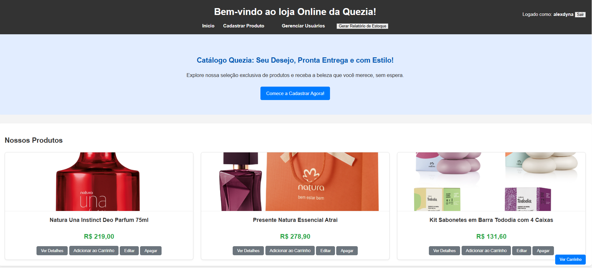
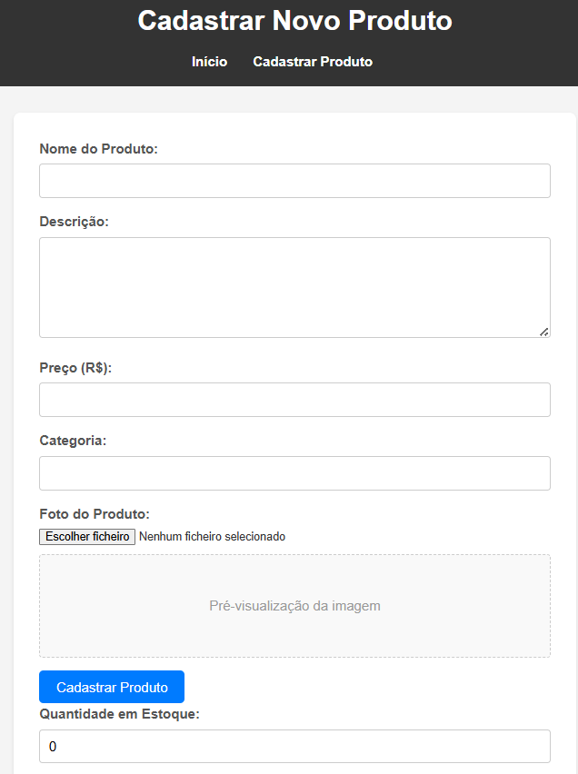
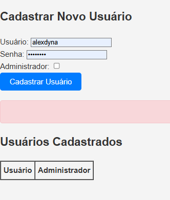
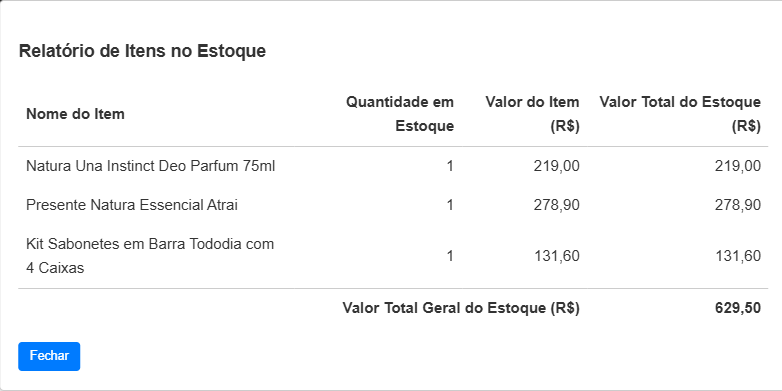
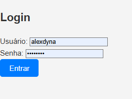

🚀 Catálogo Online da Quezia: Seu Negócio no WhatsApp!
(Sugestão: Crie uma imagem de capa atrativa que mostre o layout principal ou um mockup do aplicativo em uso.)

💡 Visão Geral e Propósito do Projeto
Em um mundo cada vez mais digital, pequenos negócios precisam de soluções ágeis para alcançar seus clientes. O Catálogo Online da Quezia nasce dessa necessidade, oferecendo uma plataforma simples, intuitiva e eficiente para a exibição de produtos e a facilitação de pedidos via WhatsApp.

O foco principal é eliminar barreiras como cadastros complexos e logins, proporcionando uma experiência de compra fluida. Os clientes podem navegar pelo catálogo, adicionar produtos a um carrinho virtual e, com um único clique, enviar o resumo do pedido diretamente para o número de WhatsApp da loja, agilizando o processo de venda e comunicação. A persistência do carrinho no navegador do cliente, via localStorage, garante que a seleção de itens não seja perdida ao navegar ou recarregar a página.

Problema que resolve: A dificuldade de pequenos comerciantes em ter uma presença online eficaz e um canal de vendas direto e descomplicado para seus clientes.
Objetivo: Proporcionar à loja da Quezia uma ferramenta robusta, porém de fácil gerenciamento, para expor seus produtos e converter visitantes em vendas através da conveniência do WhatsApp.

✨ Funcionalidades Destaque
1. 🛍️ Catálogo de Produtos Dinâmico e Gerenciável
Carregamento Dinâmico: Produtos são buscados em tempo real de uma robusta API REST (/api/products), assegurando que o catálogo apresentado ao cliente esteja sempre sincronizado com o estoque e as novidades da loja.
Exibição Rica: Cada produto é exibido com sua imagem, nome, preço e descrição, oferecendo uma prévia completa para o cliente.
Painel Administrativo Simplificado: Acesso a funcionalidades administrativas que permitem:
- Edição de Produtos: Atualizar informações de itens existentes de forma rápida e intuitiva.
- Exclusão de Produtos: Remover itens que não estão mais disponíveis no catálogo.

2. 🛒 Carrinho de Compras Inteligente
Adição Facilitada: Botões "Adicionar ao Carrinho" em cada card de produto permitem que os clientes construam seus pedidos com facilidade.
Controle de Quantidade Automático: Ao adicionar um produto já existente no carrinho, a quantidade é automaticamente incrementada, otimizando a experiência do usuário.
Confirmação Visual Instantânea: Alertas amigáveis confirmam a adição de itens ao carrinho, proporcionando feedback imediato.
Acesso e Gerenciamento Intuitivo: Um botão flutuante persistente "Ver Carrinho" (localizado no canto inferior direito da tela) abre um modal interativo com todos os detalhes do pedido.
Flexibilidade na Edição: Dentro do modal do carrinho, o cliente pode:
- Visualizar nome, preço unitário e quantidade de cada item.
- Remover itens individualmente, recalculando o total do pedido em tempo real.
Transparência Total: O valor total do carrinho é sempre visível e atualizado dinamicamente no modal.
Persistência Local: Utiliza localStorage para manter os itens do carrinho salvos no navegador do cliente, mesmo após fechar ou recarregar a página.

3. 💬 Envio Descomplicado de Pedidos via WhatsApp
Geração Automática de Mensagem: No modal do carrinho, o botão "Enviar WhatsApp" constrói automaticamente uma mensagem formatada com todos os detalhes do pedido.
Conteúdo da Mensagem: Inclui uma lista clara de produtos (nome, preço unitário, quantidade) e o valor total do pedido.
Integração Direta: A mensagem é pré-preenchida e enviada diretamente para o WhatsApp Web ou aplicativo (se instalado no dispositivo), direcionada ao número da loja configurado, agilizando o contato e a finalização da venda.

4. 🖼️ Visualização Detalhada de Produtos
Modal de Detalhes: Ao clicar em "Ver Detalhes" na página inicial, um modal exibe a imagem do produto em tamanho maior junto com a descrição completa, proporcionando uma melhor experiência visual e informativa.

💻 Arquitetura e Tecnologias
Este projeto segue uma arquitetura Client-Server tradicional, dividida em Frontend e Backend, garantindo modularidade e escalabilidade.

Frontend (Folder: public/)
Construído com as tecnologias web fundamentais, focado em uma experiência de usuário leve e responsiva.

- HTML5: Define a estrutura semântica das páginas e o layout dos elementos.
- CSS3: Responsável por toda a estilização, layout adaptativo (responsividade) e experiência visual agradável.
- JavaScript (Vanilla): Implementa toda a lógica interativa do lado do cliente, incluindo:
  - Manipulação do DOM para exibição dinâmica de produtos.
  - Gerenciamento completo do carrinho de compras usando localStorage.
  - Integração com a API do backend para buscar e enviar dados.
  - Formatação e envio da mensagem para o WhatsApp Web.

Backend (File: server.js)
Desenvolvido em Node.js, atua como a espinha dorsal do sistema, gerenciando a lógica de negócios e a interação com o banco de dados.

- Node.js: Ambiente de execução JavaScript no servidor, escolhido por sua performance e capacidade de lidar com I/O assíncrono.
- Express.js: Framework web minimalista para Node.js, facilitando a criação de rotas da API REST e a manipulação de requisições HTTP.
- MongoDB: Banco de dados NoSQL flexível e escalável, utilizado para armazenar os dados dos produtos.
- Mongoose: ODM (Object Data Modeling) para MongoDB, simplificando a interação com o banco de dados através de esquemas e modelos.
- Multer: Middleware crucial para o Express, responsável por lidar com o upload de arquivos (especificamente as imagens dos produtos). As imagens são armazenadas localmente no diretório uploads/.
- CORS (cors): Middleware para habilitar a comunicação entre o frontend (rodando em uma porta) e o backend (rodando em outra), essencial para evitar problemas de Cross-Origin Resource Sharing.
- dotenv (dotenv): Biblioteca para carregar variáveis de ambiente de um arquivo .env, garantindo que informações sensíveis (como strings de conexão do banco de dados e chaves de API) sejam mantidas fora do código-fonte e facilmente configuráveis para diferentes ambientes.

🔗 Integrações
- API RESTful: Comunicação entre Frontend e Backend via requisições HTTP (GET, POST).
- WhatsApp Web API: Utiliza URLs de esquema (whatsapp://send ou https://wa.me/) para pré-preencher mensagens e iniciar conversas no WhatsApp.

⚙️ Configuração e Execução (Guia para Desenvolvedores)
Siga estas instruções para configurar e rodar o projeto em seu ambiente de desenvolvimento.

Pré-requisitos
Certifique-se de ter as seguintes ferramentas instaladas:

- Node.js (versão LTS recomendada, ex: v20.x.x ou superior)
- npm (gerenciador de pacotes do Node.js, vem com o Node.js)
- Uma instância do MongoDB rodando (localmente ou um cluster gratuito no MongoDB Atlas).

1. Clonar o Repositório
Abra seu terminal ou prompt de comando e execute:

```bash
git clone https://github.com/walterdyna/Projeto-site-de-vendas
cd Projeto-site-de-vendas
```

2. Configurar Variáveis de Ambiente
Crie um arquivo chamado `.env` na raiz do seu projeto (na mesma pasta de `package.json` e `server.js`) e adicione as seguintes variáveis:

```env
# URL de conexão com o seu banco de dados MongoDB
MONGODB_URI=sua_string_de_conexao_do_mongodb_atlas_ou_local

# Porta em que o servidor Express irá rodar
PORT=3000
```

Exemplo MongoDB Atlas: `mongodb+srv://<username>:<password>@cluster0.abcde.mongodb.net/catalogo_db?retryWrites=true&w=majority`  
Exemplo Local: `mongodb://localhost:27017/catalogo_db`

3. Instalar Dependências do Projeto
Na raiz do projeto, execute o comando para instalar todas as bibliotecas necessárias:

```bash
npm install
```

4. Verificar a Estrutura do Projeto
Para que o backend possa servir os arquivos do frontend corretamente, a estrutura do seu projeto deve seguir este padrão:

```
seu-projeto/
├── .env
├── package.json
├── server.js
├── uploads/              # Diretório para onde as imagens serão salvas pelo Multer
└── public/               # Contém todos os arquivos estáticos do Frontend
    ├── index.html
    ├── cadastro.html
    ├── css/
    │   └── style.css
    └── js/
        ├── main.js
        └── cadastro.js
```

Certifique-se de que todos os seus arquivos HTML, CSS e JavaScript estão localizados DENTRO da pasta `public/`.

5. Iniciar o Servidor Node.js
Certifique-se de que sua instância do MongoDB esteja em execução. Em seguida, na raiz do projeto, execute:

```bash
npm start
# Ou diretamente: node server.js
```

Você deverá ver mensagens no terminal indicando que o servidor foi iniciado e conectado ao MongoDB:

```
Conectado ao MongoDB!
Servidor rodando em http://localhost:3000
Frontend disponível em http://localhost:3000
```

6. Acessar o Catálogo Online
Abra seu navegador web e digite o seguinte endereço:

```
http://localhost:3000
```

📱 Configuração do Número de Contato do WhatsApp
Para que o botão "Enviar WhatsApp" funcione corretamente, você precisa configurar o número de telefone da loja.

Abra o arquivo `public/js/main.js` e localize a seguinte constante:

```js
// ATENÇÃO: Altere este número para o número de WhatsApp da sua loja.
// Formato: Código do País + DDD + Número (apenas dígitos, sem traços, espaços ou parênteses).
// Exemplo para um número de São Paulo, Brasil: '5511999999999'
const whatsappPhoneNumber = '5511999999999';
```

Substitua `'5511999999999'` pelo número de WhatsApp real e completo da sua loja.

📸 Imagens Ilustrativas do Projeto





(Insira aqui as capturas de tela do seu projeto para demonstrar as funcionalidades.)

- Página Principal do Catálogo: Uma visão geral da interface principal com os produtos.
- Modal do Carrinho de Compras: Demonstra o carrinho aberto com itens, total e botões de ação.
- Exemplo de Mensagem Gerada para o WhatsApp: Uma captura de tela da mensagem pré-preenchida no WhatsApp Web.

🔮 Próximos Passos (Roadmap)
Este projeto é uma base sólida e pode ser expandido com diversas funcionalidades. Algumas ideias para futuras melhorias incluem:

- Autenticação de Usuários: Implementar login para clientes e administradores, permitindo perfis personalizados e histórico de pedidos.
- Sistema de Busca e Filtro: Adicionar funcionalidade de busca por nome de produto, categoria ou faixa de preço.
- Paginação do Catálogo: Melhorar a experiência em catálogos grandes, dividindo os produtos em páginas.
- Gestão de Pedidos: Um painel administrativo mais robusto para gerenciar e acompanhar pedidos recebidos.
- Detalhes do Produto: Páginas dedicadas para cada produto com mais informações, galerias de imagens, etc.
- Checkout Simplificado: Integração com gateways de pagamento (ex: Mercado Pago, PagSeguro) para pagamentos diretos.
- Notificações: Adicionar notificações em tempo real para novos pedidos.

🤝 Como Contribuir
Contribuições são sempre bem-vindas para tornar este projeto ainda melhor!

- Faça um fork do repositório.
- Crie uma branch para sua feature (`git checkout -b feature/minha-nova-funcionalidade`).
- Faça suas alterações e commit (`git commit -m 'feat: adiciona nova funcionalidade X'`).
- Envie suas alterações para o fork (`git push origin feature/minha-nova-funcionalidade`).
- Abra um Pull Request detalhando as mudanças.

✉️ Contato e Suporte
Para dúvidas, sugestões, ou caso precise de suporte:

Alex Dyna  
Email: wdyna@hotmail.com 
GitHub: [walterdyna](https://github.com/walterdyna)  

Obrigado por explorar o Catálogo Online da Quezia!
